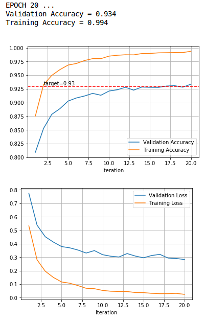
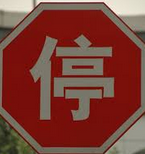

# Traffic Sign Recognition

## 1. Objective

The goals steps of this project are the following:
1. Load the data set (see below for links to the project data set)
1. Explore, summarize and visualize the data set
1. Design, train and test a model architecture
1. Use the model to make predictions on new images
1. Analyze the softmax probabilities of the new images
1. Summarize the results with a written report


[//]: # (Image References)

[image1]: ./examples/visualization.jpg "Visualization"
[image2]: ./examples/grayscale.jpg "Grayscaling"
[image3]: ./examples/random_noise.jpg "Random Noise"
[image4]: ./examples/placeholder.png "Traffic Sign 1"
[image5]: ./examples/placeholder.png "Traffic Sign 2"
[image6]: ./examples/placeholder.png "Traffic Sign 3"
[image7]: ./examples/placeholder.png "Traffic Sign 4"
[image8]: ./examples/placeholder.png "Traffic Sign 5"

## 2. Submission Files

1. This writeup !
2. The project code, which is submitted with this writeup and also availiable at [my github](https://github.com/clausqr/XXXXXX)


## 3. Dataset Exploration

### 3.1. Data Set Summary

The "German Traffic Dataset" from [http://benchmark.ini.rub.de/](http://benchmark.ini.rub.de/) was loaded from the pickle files and put into 3 separate collections, one for training, one for validation and one for testing. To summarize the data and explore it, these three collections were collapsed into a single one.

A single readout of the data properties gives the following information:
```
Number of training examples = 34799
Number of testing examples = 12630
Number of validation examples = 4410
Total number of examples = 51839
Image data shape = (32, 32)
Number of classes = 43
```
totalling more than 50.000 data items, 35.000 of which will be used for training.

### 3.2. Exploration

An example image from each of the classes was printed on a chart, to have a preliminary view of the dataset:


To further understand the structure of the dataset, a histogram showing the image count per label was printed:


This shows a biased label distribution in the original dataset.

## 4. Design and Test a Model Architecture

To obtain good results, the data was first preprocessed to improve discriminability, then the dataset was augmented to correct for statistic bias and this augmentation also included corruption to reduce overfitting.

### 4.1. Preprocessing

The preprocessing pipeline consisted of:
1. **Crop and resize:** Cropping the original images to match the additional data provided with the dataset, describing the placement of the traffic sign inside the image. The image was then resized to obtain a 32x32 square uniformly for all classes.
2. **Convert to grayscale:** Converting the image to grayscale reduces its memory requirement by three, and retains the main geometric features. It was checked that converting to grayscale didn't affect the training/valudation accuracy so it was used. It was performed by translating colorspace from RGB to HSV and retaining only the V channel.
3. **Normalization:** The image data was normalized to the (-1, 1) range and zero mean to maximize the dynamic range of the data and thus maximizing the unit activation.

An example of the effect of the preprocessing pipeline can be seen in the following image:


### 4.2. Data Augmentation

The first runs were showing signs of overfitting (difference between validation and training accuracy in the order of 3% or 4%), so the dataset was augmented to obtain a flat histogram, eliminating also the bias in image classes distribution. The number of images per class was taken to 2500 images per class, so in total the dataset was extended to a little more than 100.000 images.

To avoid overfitting, the following steps were applied to the images being added to the set:

1. **Get a random image of the class.**
2. **Add a "sticker" to the sign in the image:** Adding random sploches [as described in this thread](https://discussions.udacity.com/t/is-such-a-train-validation-accuracy-curve-considered-a-good-one) simulates random stickers covering parts of the traffic sign, as is sometimes seen in real life. Not all images get a "sticker", but they get one with probability 1/4. The location and size of the "sticker" is also random.
3. **Add noise** to simulate bad camera quality. Noise amplitude is varied randomly.
4. **Slightly rotate** the images as to simulate different angles and orientations of the camera.
5. **Slightly translate** the image as to further simulate different pictures.
6. **Randomize image gamma** as to simulate different lighting conditions.

With this whole randomization process a single image of the dataset can be used to generate seveal new training images, as shown in the following figure:


The last step was shuffling the images as not to feed them in a sequential order to avoid unit conditioning.


### 4.3. Model Architecture

The base model used is a modified version of the LeNet network.

My final model consisted of the following layers:

| Layer         		|     Description	                    					|
|:-----------------:|:---------------------------------------------:|
| Input         		| 32x32x1 Grayscale image   						       	|
| Convolution 5x5   | 1x1 stride, valid padding, outputs 28x28x6 	  |
| RELU					    |												                        |
| Average pooling	  | 2x2 stride,  outputs 14x14x6 				          |
| Convolution 5x5	  | 1x1 stride, valid padding, outputs 10x10x16	  |
| RELU					    |												                        |
| Average pooling	  | 2x2 stride,  outputs 5x5x16 				          |
| Flatten	          | outputs 400 				          |
| Fully connected		| 400 to 4*N_CLASSES = 172 									|
| RELU					    |												                        |
| Dropout					    |		KEEP_PROB								                        |
| Fully connected		| 4*N_CLASSES = 172 to 2*N_CLASSES = 86 									|
| RELU					    |												                        |
| Dropout					    |							KEEP_PROB					                        |
| Fully connected		| 2*N_CLASSES = 172 to N_CLASSES = 43 									|
| Softmax				|  |

Where average pooling was used instead of max pooling and the dropout layers were used for regularization.

### 4.5. Model Training

To obtain an insight of what was going on during training, the curves of training/validation accuracy and loss were plotted for each run.

The first curves (before data augmentation and fine tuning) were showing signs of overfitting and were not reaching the target 93% accuracy. After parameter tuning the 93% mark was reached but still very large overfitting was seen, as for example:



Then, data augmentation was introduced as training runs were iterated, and after a lot of further fine tuning and experimentation, including:
1. Changing the pooling from max pooling to average pooling
2. varying the size of the fully connected layers
3. adding dropout and experimenting with the KEEP_PROB
4. dataset augmentation
the plots improved to something like:


Furthermore, training accuracy only outperfoms validation accuacy after some iterations, but at first training accuracy is lower than validation accuracy due to the heavy way in which augmented data is being corrupted to fight overfitting.

Validation accuracy above 94% was obtained, and the difference between training and validation accuracy of around 0.5%, there is no significant overfitting.

The hyperparameters after tuning were obtained as:

```
Using EPOCHS=21, BATCH_SIZE=108, LEARNING_RATE=0.002000, KEEP_PROB=0.500000
```
with an artificial loop cutoff of 94% accuracy (training would stop when accuracy went over 94%). This was to beat the 93% validation set accuracy rubric requirement. Further training would go above 95%.

## 4.6. Solution Approach

Using the model and training as described above, and the the final model results were:
* **Training set accuracy of 94.6%**
* Validation set accuracy of 94.1%
* Test set accuracy of 88.5%


# 5. Test a Model on New Images

## 5.1. Acquiring New Images

Here are six images of standard, clearly visible german traffic signs, found online. Additionally,
some other non standard figures were also used, to test the inference capability of the network. In particular, modified traffic signs and foreign language signs were tried.

Details on the pictures and the related recognition performance will be discussed together in the next section, and result discussion is deferred to the following section.

## 5.2. Performance on New Images

### 5.2.1. Performance on Standard Signs

Performance on well taken pictures of the most common, standard signs was 100% accurate:


**Classification Results:**


### 5.2.2. Performance on Foreign Language Stop Signs

Next to test was on images not in the training set, but still similar in a conceptual way: Stop sign in foreign languages (and one with a letter removed!)





**Classification Results:**


### 5.2.3. Performance on (Artistically) Modified Signs

At last, a set of "artistically modified" (or vandalized) signs was run against the classififier. These images were also not in the training set:


**Classification Results:**


### 5.2.4. Performance on New Images - Summary

The overall accuracy of the classifier on the newly acquired images is of 80%, while the accuracy on the test data was of 88.5%, so the classifier may be overfitting a little bit.

## 5.3. Model Certainty - Softmax Probabilities and Results Discussion

### 5.3.1. Performance on Standard Signs
For the standard images, classification accuracy was 100% and model certainty was very large. For 4 out of 5 of the images, the softmax probabilities, as seen in the figures above, is between twice and ten times larger than the following pictures. Only the roundabout sign didn't produce such a certain output, with 100km/h speed limit getting only slightly poorer softmax score. This may be due to the fact that there are 3 arrows in the sign and 3 letters in the 100km/h sign, and the color has been removed. Including color information would probably enhance the softmax score difference for this two classes of images.

### 5.3.2. Performance on Foreign Language Stop Signs

For the stop sign in foreign languanges, the accuracy was also high, meaning that the model generalizes very well. Except for the chinese sign, all other signs were properly recognized, and with large model certainty (softmax score almost doubles the following sign). The cause for the chinese sign appearing as a speed limit may be due to the fact that it has strange features in the center, and also because color information was discarded. Feeding color information to the network should get rid of this issue. Also it is worth noting that the "_TOP" sign, with the "S" removed, produced an accurate result with large certainty, and this is most likely due to the fact that the "sticker technique" was used to augment the training data, meaning that such an image was probably experienced during training.

### 5.3.3. Performance on (Artistically) Modified Signs

The artistically modified signs were the most difficult images to classify by the classifier, mainly because some of they are heavily modified versions of the ones experienced by the network. The ET picture was recognized as a "No vehicles" sign, which is the base sign on which the ET bicycle was painted over, meaning that it is an accurate prediction. But the 120km/h sign also gets a large softmax score, owing to the fact that the tires of the bicycle look like numbers. The "Yield with love" sign was also correctly classified based on the base sign, but gets a much larger certainty becauses it is the only triangle upside down picture. The "king being carried" also gets correctly classified with good certainty. The "woman carrying husband" sign gets recognized as "Wild animals crossing" because of the graphical similarity, but with little certainty. And the "heart and arrow" gets wrongly classified with great certainty because of the arrow being broken in two and the curve features inserted by the heart.

# 6. Conclusion and Future Work

A traffic sign classifier was built, trained and evaluated. Validation accuracy of more than 93% was achieved by pre-processing and augmenting the training set, and finely tuning a modified version of a LeNet network. Of particular interest is the "sticker" techinque of adding splotches to the images to obscure some pat of the input, which brought a large improvement in accuracy and loss.

Prediction accuracy and certainty for good pictures is very high. It also generalizes very well to foreign language and character traffic signs. For artistically modified images generalization is also good but certainty decreases in some cases.

Taking into account these results, the classifier can be improved by including color information in the pre-processing pipeline. Also, the "sticker" technique can be further improved by including actual stickers in the splotches instead of plain color. And it is tought that the model parameters can be further tuned to improve overall performance.
